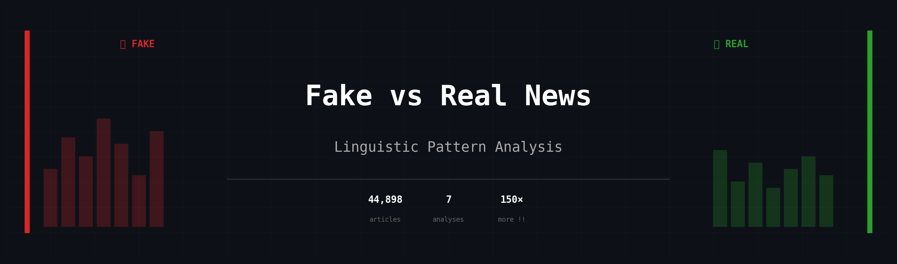
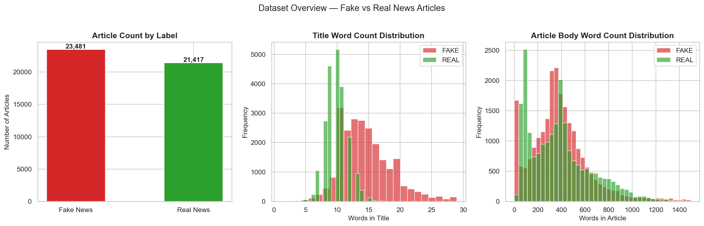
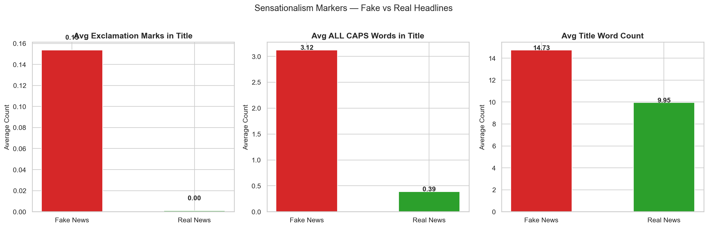
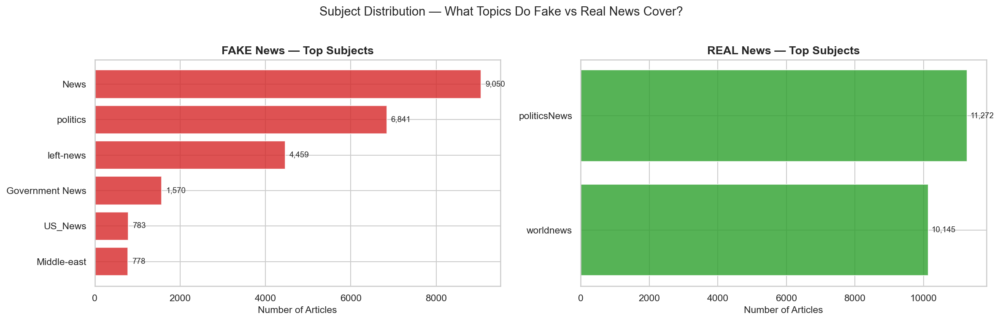
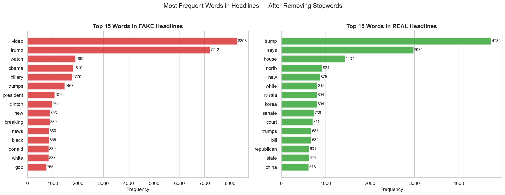
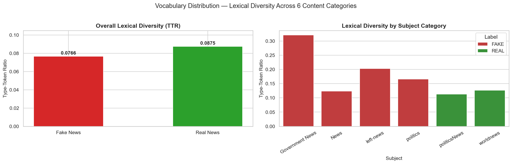
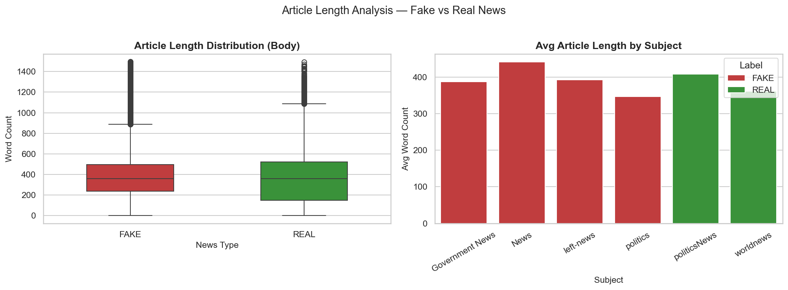
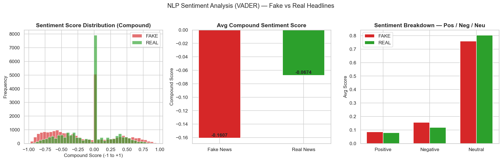

<div align="center">


</div>

---

A lot of fake news detection research jumps straight to building classifiers. This project takes a step back and asks a simpler question first: **can you actually see the difference** between fake and real news just by looking at how they're written?

Turns out, yes — pretty clearly.

Pure EDA + NLP on ~44k political news articles. No models, no accuracy scores. Just patterns.

---

## Results at a Glance

| Metric | 🔴 Fake | 🟢 Real | Takeaway |
|--------|---------|---------|----------|
| Avg exclamation marks (title) | 0.15 | 0.00 | **150× more in fake** |
| Avg ALL CAPS words (title) | 3.12 | 0.39 | **8× more in fake** |
| Avg title word count | 14.73 | 9.95 | Fake headlines ~48% longer |
| Lexical diversity (TTR) | 0.077 | 0.088 | Real vocabulary ~14% richer |
| VADER sentiment (compound) | -0.161 | -0.067 | Fake headlines 2.4× more negative |
| Top headline word | *video* | *trump* | Engagement-bait vs event reporting |
| Subject categories | 6 fragmented | 2 clean | Fake: vague tags, Real: editorial structure |

---

## What I looked at

1. Dataset balance and article length distributions
2. Sensationalism signals in headlines — exclamation marks, ALL CAPS, title length
3. What topics each class actually covers across 6 content categories
4. Which words dominate fake vs real headlines after custom preprocessing
5. Vocabulary distribution and lexical diversity (Type-Token Ratio)
6. Article body length by class and subject
7. NLP sentiment analysis using VADER

---

## Findings

### 1. Dataset Overview



Classes are close to balanced (~52/48). The title length distributions already hint at something — real news titles cluster tightly around 8–10 words, while fake news titles spread wider and peak later. Body word count distributions are both heavily right-skewed, expected for news articles.

---

### 2. Sensationalism in Headlines



The most striking finding in the whole project. Fake headlines average **0.15 exclamation marks** vs **0.00 for real news**. ALL CAPS word usage is **3.12 vs 0.39**. Fake titles are also ~48% longer (14.73 vs 9.95 words). None of this is subtle — it shows up in the raw averages without any modelling.

---

### 3. Subject Distribution



Real news splits almost entirely between two clean categories: `politicsNews` (11,272) and `worldnews` (10,145). Fake news fragments across six vague categories — "News", "politics", "left-news", "Government News" — labels that feel more like tags slapped on content than actual editorial structure. The existence of "left-news" as a dedicated category with 4,459 articles says something about the ideological targeting patterns in this dataset.

---

### 4. Vocabulary



After the preprocessing pipeline (lowercasing → punctuation removal → stopword filtering), the top word in fake headlines is *video* (8,303), followed by *watch* and *breaking*. Real headlines lead with *trump*, then *says* — straightforward event-reporting language. The fake vocabulary is almost entirely engagement-bait. The real vocabulary reads like a wire service.

---

### 5. Vocabulary Distribution — Lexical Diversity



Type-Token Ratio (TTR) measures lexical richness: unique words divided by total words. Real news scores **0.0875** vs fake at **0.0766** overall. The per-category breakdown is sharper — the large fake categories ("News", "politics") are lexically repetitive, the same emotionally charged words recycled across thousands of headlines. Real news categories maintain higher diversity throughout.

---

### 6. Article Length



Median body lengths are similar (~350–380 words) but real news has a heavier upper tail — more long-form reporting. The subject-level breakdown also reflects how differently the two sources were structured editorially: fake news categories have no real news counterparts, which is itself a signal.

---

### 7. NLP — Sentiment Analysis (VADER)



Both classes skew slightly negative — political news generally does. But fake headlines are meaningfully more negative: **-0.1607 vs -0.0674**, roughly 2.4× more negative on average. The distribution chart shows real news spiking sharply at 0 — most real headlines are deliberately neutral in tone. Fake headlines spread wide across the negative range. The pos/neg/neu breakdown confirms it: fake news carries higher negative sentiment while real news is substantially more neutral overall.

---

## Running it yourself

```bash
git clone https://github.com/shamizer-h/fake-news-analysis.git
cd fake-news-analysis

pip install pandas numpy matplotlib seaborn nltk

# place Fake.csv and True.csv in root (download from Kaggle link above), then:
jupyter notebook fake_news_analysis.ipynb
```

Python 3.8+. Cells run top to bottom with no modifications needed.

---

## Stack

| Tool | Purpose |
|------|---------|
| pandas · numpy | Data loading, feature engineering |
| NLTK | Stopword removal, VADER sentiment scoring |
| matplotlib · seaborn | All 7 visualisations |
| Jupyter Notebook | Analysis environment |

---

## Dataset

[Kaggle — Fake and Real News Dataset](https://www.kaggle.com/datasets/clmentbisaillon/fake-and-real-news-dataset) by Clément Bisaillon. US political news, 2015–2018.

> `Fake.csv` and `True.csv` are not tracked in this repo. Download from Kaggle and place both in the project root.

---

## Limitations

The dataset covers US political news from a specific three-year window — findings likely don't generalise to other domains, languages, or time periods. Fake/real labels come from the original curator and weren't independently verified. Everything here is correlational — a neutral headline with no exclamation marks can still be misinformation.

---

## Author

Shamizer Hussain · [github.com/shamizer-h](https://github.com/shamizer-h)
